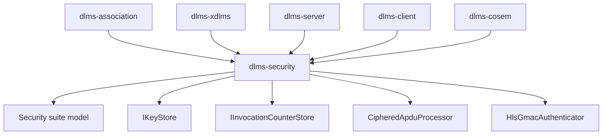
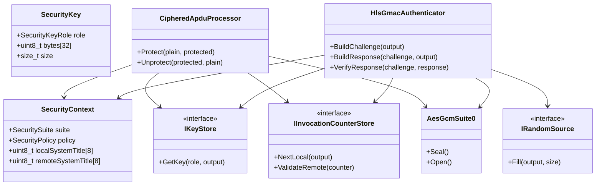
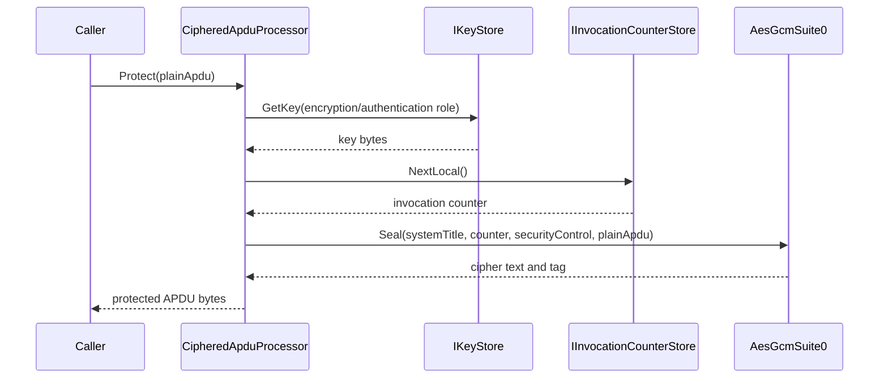
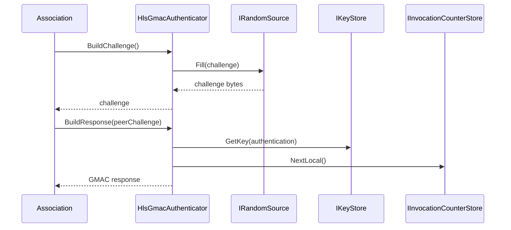

# 02. Security Architecture

## 1. Scope

`dlms-security` is a pure application-security library. It executes security
algorithms and policy checks for higher layers without owning transport,
association state, xDLMS dispatch, or COSEM object storage.

## 2. Layer Diagram



## 3. Module Map

```text
include/dlms/security/security_status.hpp
include/dlms/security/security_types.hpp
include/dlms/security/key_store.hpp
include/dlms/security/invocation_counter_store.hpp
include/dlms/security/random_source.hpp
include/dlms/security/ciphered_apdu_processor.hpp
include/dlms/security/hls_gmac_authenticator.hpp
src/security/...
test/security/...
```

## 4. Class Interaction Diagram



## 5. APDU Protection Flow



## 6. HLS GMAC Flow



## 7. Error Model

The layer converts all validation and cryptographic failures to
`SecurityStatus`. Runtime exceptions are not part of the public API.

Key material and plaintext APDUs must not be emitted through status names,
logging, or diagnostic strings.

## 8. Protected APDU Body

`CipheredApduProcessor` owns only the security body:

```text
security-control(1) || invocation-counter(4, big endian) ||
ciphertext(N) || authentication-tag(16)
```

For Suite 0 `AuthenticatedAndEncrypted`, the nonce is
`system-title(8) || invocation-counter(4)`. Protection uses the local system
title and `NextLocal`; unprotection uses the remote system title and accepts
the remote invocation counter only after successful authentication.

## 9. Test Strategy

Tests shall focus on:

- enum and validation behavior;
- key length validation;
- invocation counter monotonicity;
- deterministic challenge generation with fake random source;
- Suite 0 AES-GCM vectors;
- protect/unprotect round trip;
- replay rejection.
